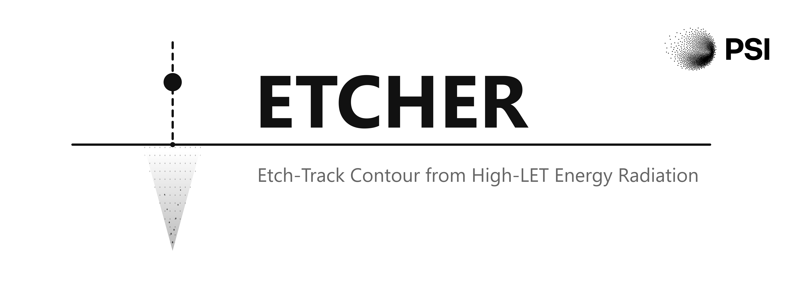

[](https://jbrage.github.io/tracketch/)
[](LICENSE)
[](https://www.python.org/)
[](tests/)


# tracketch

A Python toolkit for simulating ion tracks in CR-39 plastic nuclear track
detectors. Given an ion species, energy, and etching conditions, `tracketch`
predicts the track countours, diameter and length for a given etching duration.

The work is published in the article
[A unified model for etched-track formation in CR-39 detectors using amorphous
track structure theory](https://papers.ssrn.com/sol3/papers.cfm?abstract_id=6469212)
by Jeppe Brage Christensen.

> **Note** - due to its dependency on
> [libamtrack](https://libamtrack.github.io/), **tracketch** currently runs on
> **Linux only**. Most Windows installations support WSL installations.

<table align="center">
   <tr>
      <td bgcolor="white">
         
      </td>
   </tr>
</table>


Cite as 
```bibtex
@article{christensen2026unified,
  title={A unified model for etched-track formation in CR-39 detectors using amorphous track structure theory},
  author={Christensen, Jeppe Brage},
  journal={SSRN preprint http://dx.doi.org/10.2139/ssrn.6469212},
  year={2026}
}
```

> **Note** - This version only supports simulations of ion impinging
> perpendicular to the CR39 detector surface. Support for 3D track geometries
> and non-axisymmetric effects is planned for future releases.
> Furthermore, this etch-rate model is calibrated to the detector type and
> etching conditions used in
> [Dörschel et al (2003)](https://www.sciencedirect.com/science/article/abs/pii/S1350448702000471).
> For other detector types and etching conditions, the calibration workflow
> described in the documentation can be used to re-calibrate the model against
> experimental data.


## Documentation

The documentation is hosted online and includes user guides, API references,
and examples: [Documentation](https://jbrage.github.io/tracketch/)
A PDF version of the documentation is also available in the `docs/` directory: [tracketch_docs.pdf](docs/tracketch.pdf)

## How it works

The simulation follows the same physics chain as the real experiment:

1. **Dose maps**: the ion deposits energy radially via delta-electrons.
   `tracketch` computes the dose map along the ion path using amorphous track
   structure models from `libamtrack` (e.g. Cucinotta) and slows down the ion
   in the CR-39 detector using `SRIM` stopping-power tables.
2. **Etch-rate model**: a calibrated function converts local dose to local
   etch velocity $v_d$. The bulk (undamaged) material etches at a slower
   constant rate $v_\text{bulk}$.
3. **Wavefront propagation**: the etchant front is propagated from the detector
   surface into the bulk using shortest-path algorithms (Dijkstra or Fast
   Marching), analogous to the propagation of a wavefront. The result is an
   *arrival-time map*.
4. **Track observables**: iso-time contours of the arrival-time map give the
   etched track shape at any desired etching duration.


## Installation

```bash
# clone the repository
git clone <repo-url>/tracketch
cd tracketch

# create a virtual environment and install; change "all" to "numba" or "cpp"
# to only install one backend or to skip testing/docs dependencies
python3 -m venv .venv
source .venv/bin/activate
pip install -e ".[all]"
```

This installs `tracketch` with the Numba-accelerated Dijkstra backend, which
works out of the box on any Linux machine.

### Optional: C++ Dijkstra backend
To also install the faster CPP backend, use
```bash
pip install -e ".[numba,cpp]"
cd tracketch/wavefront/dijkstra/cpp
python setup_dijkstra.py build_ext --inplace
```

## Minimal working example
Check out the `tracketch` examples  in the [`examples/`](examples/) directory.
```python
import matplotlib.pyplot as plt
from tracketch import TrackSimulator

# Set up a 270 MeV/u carbon-12 ion hitting CR-39
sim = TrackSimulator(
    particle_name="12C",
    start_energy_MeV_u=270.0,
)

# Extract track contours after different etching durations
fig, ax = plt.subplots()
for idx, t in enumerate([0.5, 1.0, 2.0, 3.0]):
   r, z = sim.get_iso_time_contour(etching_time_h=t)
   line, = ax.plot(r, z, label=f"{t} h")
   ax.plot(-r, z, color=line.get_color())  # mirror 

ax.set_xlabel("r / um")
ax.set_ylabel("z / um")
ax.invert_yaxis()
ax.legend(title="Etch time")
ax.set_aspect("equal")
plt.tight_layout()
plt.show()
```


## Particle and material names

### Particle names

Particle names use the `"<A><symbol>"` format where `A` is the mass number
and `symbol` is the element symbol:

| Name | Ion |
|------|-----|
| `"1H"` | proton |
| `"2H"` | deuteron |
| `"4He"` | alpha particle |
| `"56Fe"` | iron-56 |

The available ions depend on the **stopping-power source**:

- **`stopping_power_source="SRIM"` (default)** - uses tabulated `SRIM` data.
  Only the following particles are supported:
  ```python
  import tracketch
  print(tracketch.SRIM_PARTICLES)
  # ('1H', '2H', '3H', '4He', '7Li', '9Be', '11B', '12C', '14N', '16O')
  ```
  Attempting any other particle raises a `ValueError` with a suggestion to
  switch source.

- **`stopping_power_source="libamtrack"`** - uses the `libamtrack`
  parametrisation. Accepts any nuclide name recognised by `libamtrack`, e.g.
  `"56Fe"`, `"238U"`, `"28Si"`.

```python
from tracketch import TrackSimulator

# Heavy ion - must use libamtrack
sim = TrackSimulator(
    particle_name="56Fe",
    start_energy_MeV_u=1000.0,
    stopping_power_source="libamtrack",
)
```

### Material names

Only two materials are supported:

```python
import tracketch
print(tracketch.MATERIALS)   # ('CR39', 'water')
```

Pass them as `material_name="CR39"` (default) or `material_name="water"`.

## Simulation grid

The simulation operates on a cylindrical grid (*r*, *z*) with these defaults:

| Parameter | Default | Description |
|-----------|---------|-------------|
| `r_min_um` | `1e-4` um | Inner radial boundary (log-spaced grid) |
| `r_max_um` | `20` um | Outer radial boundary |
| `z_max_um` | `40` um | Maximum track depth |
| `n_points_r` | `400` | Number of radial grid points |
| `n_points_z` | `100` | Number of depth grid points |

All five can be overridden as keyword arguments to `TrackSimulator`:

```python
from tracketch import TrackSimulator

sim = TrackSimulator(
    particle_name="12C",
    start_energy_MeV_u=270.0,
    r_max_um=40,    # wider radial extent
    z_max_um=80,    # deeper track
    n_points_r=600, # finer radial resolution
    n_points_z=200, # finer depth resolution
)
```

Increasing grid resolution improves accuracy at the cost of longer compute
time. For quick exploration the defaults are a good starting point; for
publication-quality results consider doubling `n_points_r` and `n_points_z`.

## Building the documentation

Full API reference and usage guides can be re-built with Sphinx:

```bash
pip install -e ".[docs]"
cd docs
make html
```
Then open `docs/_build/html/index.html` in your browser.
Or 
```bash
make pdlatex
```
to build the PDF version of the documentation.

## Project layout

```
.
├── tracketch/                 Core library
│   ├── physics/               Ion physics: LET, CSDA, RDD (SRIM + libamtrack)
│   │   └── stopping_power/    SRIM data tables and parsing
│   ├── etching/               EtchRateModel -- dose -> etch velocity
│   ├── simulation/            TrackSimulator -- full model
│   └── wavefront/             Track contour calculation through arrival-time
│                              solvers (Dijkstra, FMM)
├── calibration/               Etch-model calibration against experimental data
├── examples/                  Runnable example scripts
├── tests/                     pytest test suite
├── docs/                      Sphinx documentation source and files to reproduce the manuscript
├── README.md
├── LICENSE
└── pyproject.toml
```

## License

See [LICENSE](LICENSE).
